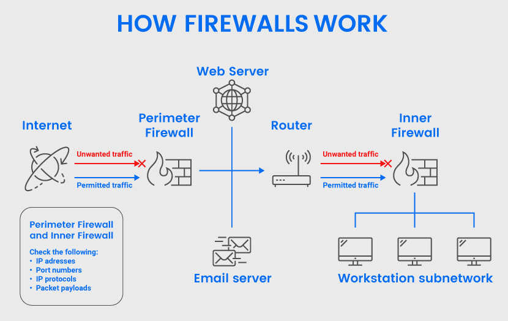

# Firewall

## Table of contents

- [Firewall](#firewall)
  - [Table of contents](#table-of-contents)
  - [Introduction](#introduction)
  - [Type of firewalls](#type-of-firewalls)
  - [How firewalls work](#how-firewalls-work)
  - [An open-source firewall: pfSense](#an-open-source-firewall-pfsense)
    - [Overview of pfSense](#overview-of-pfsense)
  - [Hand-on labs](#hand-on-labs)

## Introduction 

- Firewall is a network security system that monitors and controls incoming and outgoing network traffic based on predetermined security rules. 
- It acts as a barrier between a trusted internal network and untrusted external networks, such as the internet.

## Type of firewalls

- Three main types of firewall (depending on structure):
  - Hardware
  - Software
  - Both hardware and software

- Types of Firewalls (Depending on features)
  - Next-generation firewall (NGFW)
  - Packet-filtering firewall.
  - Proxy firewall.
  - Stateful inspection firewall.
  - Application firewall.

## How firewalls work

- A packet is a piece of data formatted for Internet transfer that contains
- Firewalls analyze packets based on pre-set rules to distinguish between benign and malicious traffic
  - Source and destination IP addresses.
  - Content in the payload.
  - Packet protocols (e.g., whether the connection uses a TCP/IP protocol).
  - App protocols (HTTP, Telnet, FTP, DNS, SSH, etc.).
  - Data patterns that indicate specific cyber attacks.

## An open-source firewall: pfSense

### Overview of pfSense

-  A powerful and flexible firewall solution with a wide range of features and capabilities
- Features:
  - Firewall
    - Firewall rules
  - VPN
  - IDS/IPS
  - Load Balancing
  - Captive Portal
  - Traffic shaping
  - High Availability

## Hand-on labs

