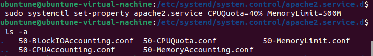
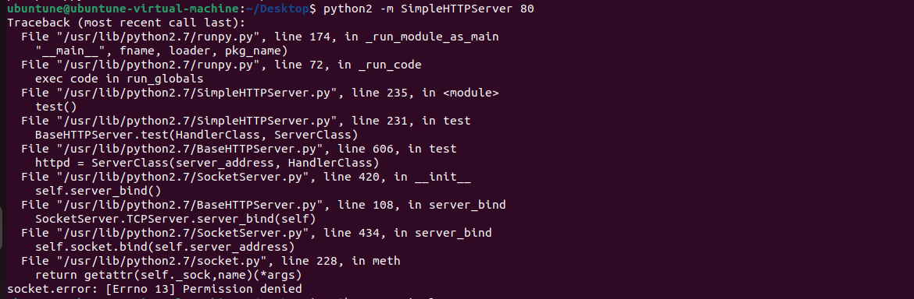
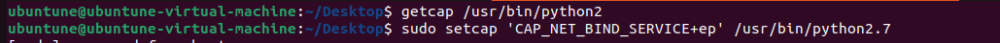
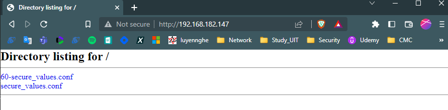
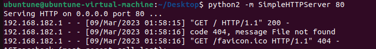

# Chapter 10: Kernel Hardening and Process Isolation

## Table of content
- [Chapter 10: Kernel Hardening and Process Isolation](#chapter-10-kernel-hardening-and-process-isolation)
  - [Table of content](#table-of-content)
  - [The /proc filesystem](#the-proc-filesystem)
  - [Change kernel parameters](#change-kernel-parameters)
  - [Process Isolation](#process-isolation)
    - [Control Groups (cgroups)](#control-groups-cgroups)
    - [Namespace Isolation](#namespace-isolation)
    - [Kernel capabilities](#kernel-capabilities)
    - [Hands-on lab – setting a kernel capability](#hands-on-lab--setting-a-kernel-capability)
    - [SECCOMP and system calls](#seccomp-and-system-calls)
    - [Process isolation with Docker containers](#process-isolation-with-docker-containers)

-------------------

- Tweaking the kernel can help to prevent certain network attacks and certain types of information leaks.
- Process isolation: prevent malicious users taking control of root process or a process that belongs to some other user.

## The /proc filesystem
- Content in /proc is created from scratch  every time you boot a Linux machine, it have two general classes of information:
  - User mode processes
  - What's going on at the kernel level of the operating

- User mode process: 
  Numbered directories on /proc corresponds to the Process ID (PID) number of a usermode process
  - Use `ps` (static), `top`(dynamic) to read information from it easily.

- Kernel information:
  The files and directories that have actual names contain information about what's going on with the Linux kernel

## Change kernel parameters
- Some ways to change kernel parameters
  - echo a new value into the parameter from the command line.
  - Use the `sysctl` utility from the command line.
    - List all the parameter settings: `sudo sysctl -a`
    - Write new value: `sudo sysctl -w <parameter>=<value>` (noramlly this is a temporary change)
  - Configure the /etc/sysctl.conf file.
    - Ubuntu: contains files with default settings
    - CentOS: contains symbolic link
      - Make changes by creating new configuration file in the /etc/sysctl.conf directory
  - Add a new .conf file that contains the new configuration to the /etc/sysctl.d directory.
  - Run a command from within a shell script.

- Setting additional kernel-hardening parameters
  - Lynis is a security scanner that shows lots of information about a system

- Preventing users from seeing each others' processes:
  - Add this line to the end of `/etc/fstab` file
  > proc /proc proc hidepid=2 0 0
  - Remount `/proc`
  > sudo mount -o remount proc
  -> User who doesn't have sudo privileges can only view his or her own processes.

## Process Isolation

- Privilege escalation:
  - Vertical : obtaining root privileges.
  - Horizontal : gaining the privileges of some other normal user.

### Control Groups (cgroups)
- Function:
  - Set resource limits
  - Perform different accounting functions
  - Prioritize resources
  - Freezing, checkpointing, and restarting

- Setting resource limits:
  - Enable accounting for CPU usage, memory usage, and I/O usage.
    > sudo systemctl set-property <service_name> MemoryAccounting=1 CPUAccounting=1 BlockIOAccounting=1
    - check
      
  - Set limit resource for it (40% CPU and 500M memory usage): 
  > sudo systemctl set-property <service_name> CPUQuota=40% MemoryLimit=500M
      ;
    
=> Two ways cgroups can enhance security:
  - Provide process isolation
  - Help to limit resource usage can help prevent Dos Attack
  
### Namespace Isolation

- A namespace allows a process to have its own set of computer resources that other processes can't see. The process for each user will have their own namespaces. 
- Seven types of namespace (in `/proc/ns`):
  - Mount (mnt): Original namespace, s allows each process to have its own root filesystem that no other processes can see.
  - UTS: unique hostname and domain name
  - PID
  - Network (net)
  - Interprocess Communication (ipc)
  - Control group (cgroup):
  - User

### Kernel capabilities

- Capabilities allow the Linux kernel to divide what the root user can do into distinct units
  - List of capabilities: `man capabilities`
  - Some component utilities, program need root privileges to run, in somce case, we can use capabilities instead it.

### Hands-on lab – setting a kernel capability

### SECCOMP and system calls

- System calls (syscalls)
  - happen every time we run any command on a Linux Machine
  - Each syscall take command from user and passes it to Linux kernel
  - There are approximately 330 syscalls
  - Use `strace` to see

- Secure Computing (SECCOMP):
  - allows you to either enable just a certain subset of syscalls that you want for a process to use 
  - disable certain syscalls that you want to prevent a process from using.
  
  ### Process isolation with Docker containers
