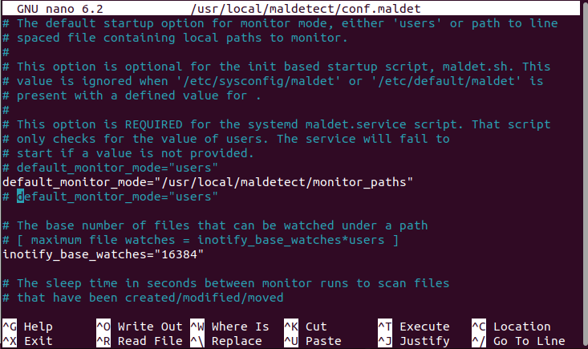
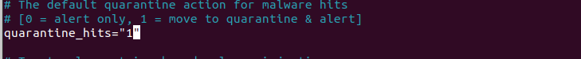
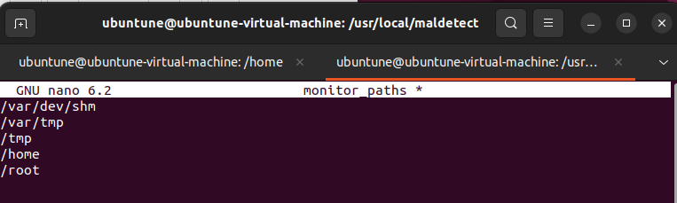
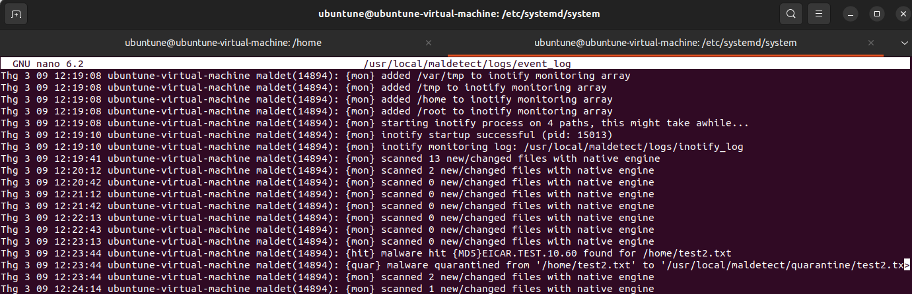

# Chapter 11: Scanning, Auditing, and Hardening

## Table of content
- [Chapter 11: Scanning, Auditing, and Hardening](#chapter-11-scanning-auditing-and-hardening)
  - [Table of content](#table-of-content)
  - [ClamAV and maldet](#clamav-and-maldet)
    - [Hands-on lab – installing ClamAV and maldet](#hands-on-lab--installing-clamav-and-maldet)
    - [Hands-on lab – configuring maldet](#hands-on-lab--configuring-maldet)
    - [Updating](#updating)
    - [Scanning](#scanning)
  - [Scanning for rootkits with Rootkit Hunter](#scanning-for-rootkits-with-rootkit-hunter)
  - [Performing a quick malware analysis with strings and VirusTotal](#performing-a-quick-malware-analysis-with-strings-and-virustotal)
  - [Understanding the auditd daemon](#understanding-the-auditd-daemon)
  - [Using ausearch and aureport](#using-ausearch-and-aureport)
  - [Applying OpenSCAP policies with oscap](#applying-openscap-policies-with-oscap)

## ClamAV and maldet

- **Linux Malware Detect** (LMD/ Maldet):
  - another FOSS antivirus program that can work alongside ClamAV
    - LMD folk freely admit, the ClamAV scan engine gives a much better performance when scanning large file sets 
    -> ClamAV can use the LMD malware signatures as well as its own malware signatures.
  - features: 
    - Automatically generates malware generates malware detection signatures when it sees
    malware on the network's edge intrusion detection systems

### Hands-on lab – installing ClamAV and maldet

### Hands-on lab – configuring maldet

### Updating 

### Scanning

- Do an antivirus scan on a Red Hat-type system would trigger an SELinux alert. We can fix it by change `antivirus_can_scan_system` to on
  > sudo setsebool -P antivirus_can_scan_system on

## Scanning for rootkits with Rootkit Hunter

## Performing a quick malware analysis with strings and VirusTotal

## Understanding the auditd daemon

## Using ausearch and aureport

## Applying OpenSCAP policies with oscap

