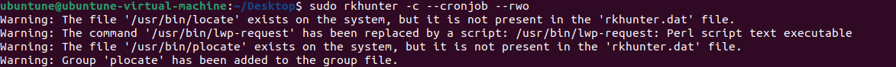
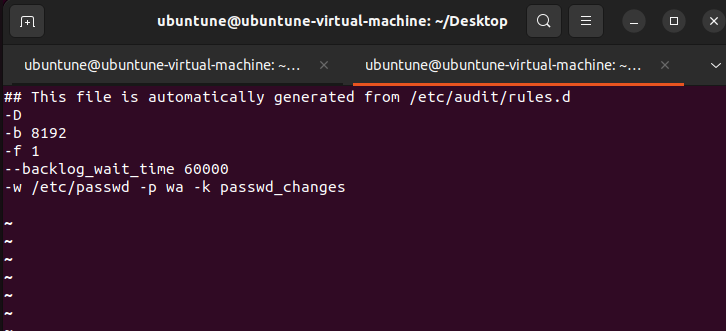
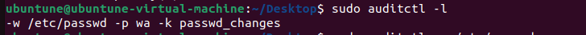
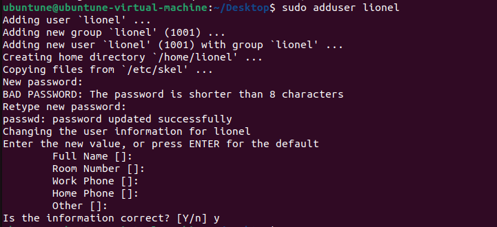
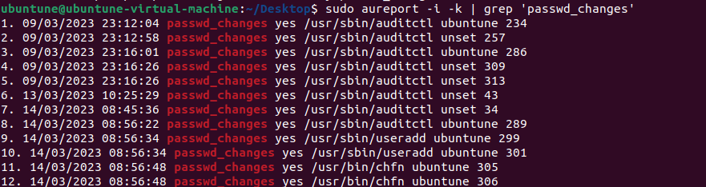
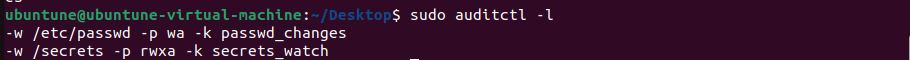
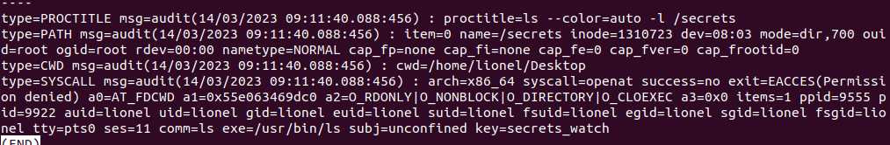

# Chapter 11: Scanning, Auditing, and Hardening

## Table of content
- [Chapter 11: Scanning, Auditing, and Hardening](#chapter-11-scanning-auditing-and-hardening)
  - [Table of content](#table-of-content)
  - [ClamAV and maldet](#clamav-and-maldet)
    - [Hands-on lab – installing ClamAV and maldet](#hands-on-lab--installing-clamav-and-maldet)
    - [Hands-on lab – configuring maldet](#hands-on-lab--configuring-maldet)
    - [Updating](#updating)
    - [Scanning](#scanning)
  - [Scanning for rootkits with Rootkit Hunter](#scanning-for-rootkits-with-rootkit-hunter)
  - [Performing a quick malware analysis with strings and VirusTotal](#performing-a-quick-malware-analysis-with-strings-and-virustotal)
  - [Auditd daemon](#auditd-daemon)
  - [Ausearch and Aureport](#ausearch-and-aureport)
    - [Hands-on lab – using auditd](#hands-on-lab--using-auditd)
  - [Applying OpenSCAP policies with oscap](#applying-openscap-policies-with-oscap)

## ClamAV and maldet

- **Linux Malware Detect** (LMD/ Maldet):
  - another FOSS antivirus program that can work alongside ClamAV
    - LMD folk freely admit, the ClamAV scan engine gives a much better performance when scanning large file sets 
    -> ClamAV can use the LMD malware signatures as well as its own malware signatures.
  - features: 
    - Automatically generates malware generates malware detection signatures when it sees
    malware on the network's edge intrusion detection systems

### Hands-on lab – installing ClamAV and maldet

### Hands-on lab – configuring maldet

### Updating 

### Scanning

- Do an antivirus scan on a Red Hat-type system would trigger an SELinux alert. We can fix it by change `antivirus_can_scan_system` to on
  > sudo setsebool -P antivirus_can_scan_system on

## Scanning for rootkits with Rootkit Hunter

- Rootkit:
  - Can listen for commands from their masters, steal sensitive data and send it to their masters, or provide an easy-access back door for their masters
  - Designed to be stealthy
  - They can replace utilities su as ls or
  ps with their own trojaned versions that will show all files or processes on the system except for the ones that are associated with the rootkit
  - To plant it, an attacker need to have root user privileges => prevent by ensuring that only trusted, authorized personnel have root privileges.

Hands-on lab – installing and updating Rootkit
Hunter

- Scanning for rootkits
  - > sudo rkhunter -c
  - Result in `/var/log/rkhunter.log`
  - Make it automatically as a cron job:
      > sudo rkhunter -c --cronjob
    - We can add option `-rwo` to show only report warnings
    
  - Make Rootkit Hunter run every night as a cron job
    > 20 22 * * * /usr/bin/rkhunter -c --cronjob --rwo
    -> scheduled to run at 22:20 (10:20 PM) every day

## Performing a quick malware analysis with strings and VirusTotal

- Analyze a file with strings
- VirusTotal
  

## Auditd daemon

- List all auditd rules: 
- > sudo auditctl -l

- Auditing a file for changes
    > sudo auditctl -w /etc/passwd -p wa -k passwd_changes
    - `-w <file_path>` : monitor file
    - `-p wa` : permission to monitor: see when anyone either tries to (w)rite to the file or tries to
    make (a)ttribute changes
    - `-k <key_name>` : assigning a key's name to a rule 
    - This is only temporary, to make it permanent, we need to create a custom rules file in the `/etc/audit/rules.d/` directory
      > sudo sh -c "auditctl -l > /etc/audit/rules.d/custom.rules"
      - Check:
        >  sudo service auditd restart

        >  sudo less /etc/audit/audit.rules

        

- Auditing a directory:
  - To monitor a directory and log events related to that directory
      > sudo auditctl -w <directory> -p x -k <key_name>
      - `x` : monitor for any read, write, attribute change, or execute actions

- Auditing system calls:
  - Creating rules to monitor action of someone
    - `sudo auditctl -a always,exit -F arch=b64 -S openat -F auid=1006`
      - `-a always,exit` : record will always be created on exit of the system call
      - `-F arch=b64` : specifies the machine's CPU is x86_64
      - `-S openat` : specifies the system call that we want to monitor
      - `-F auid=1006` : user ID

## Ausearch and Aureport
- Help to translate files into a language that makes
easy to read

- Searching for file change alerts:
  > sudo ausearch -i -k passwd_changes
  - `-i` : convert numeric data to text

- With ausearch, you have to specify the name, or key, of the audit rule that interests you after the -k option. With aureport, the -k option means that you want to look at all log entries that have to do with all audit rule keys.

- Searching for directory access rule violations
- Searching for system call rule violations
- Generating authentication reports
- Using predefined rulesets
  
### Hands-on lab – using auditd
- Add rule:
    
- Add user:
    
- Check audit messages for changes in *passwd* file
  
- Do an authentication report:
    > sudo aureport -au
- Create rule monitor folder */secrets*
    
- Log in account Lionel and view */secrets* -> "Permission Denied"
- Log in your account and view alert
    
- Make rule to permanent and reboot to see the result:
    > sudo sh -c "auditctl -l > /etc/audit/rules.d/custom.rules"

## Applying OpenSCAP policies with oscap

- `Security Content Automation Protocol (SCAP)` : Consists of hardening guides, hardening templates, and baseline configuration guides for setting up secure system.
- `OpenSACP` : a set of FOSS tools that can be used to implement SCAP:
  - Security profiles
  - Security guides
  - `oscap` command-line utility: to apply security templates
  - `SCAP Workbench` : GUI-type utility

>   Note: It is available in RHEL 7, RHEL 8, and CentOS 7 but outdated in Ubuntu

