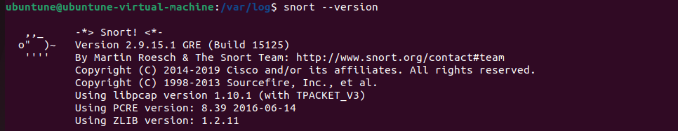
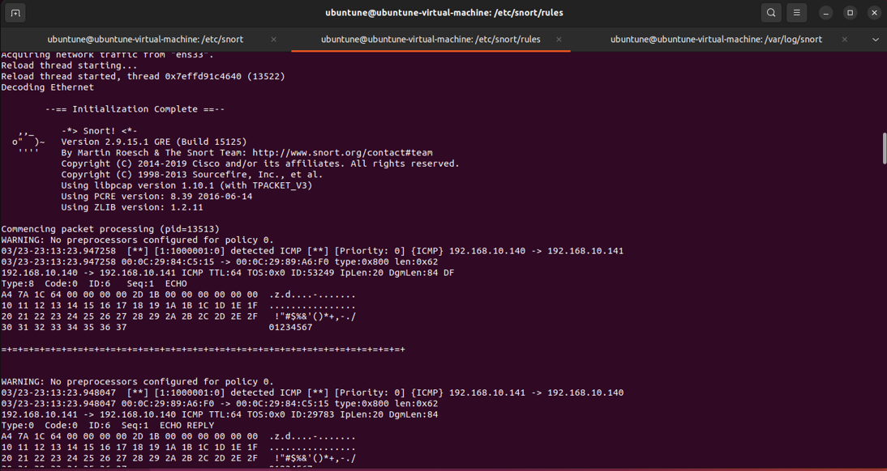
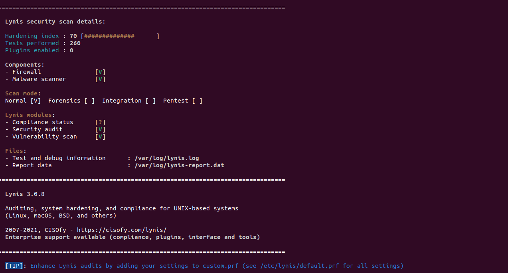
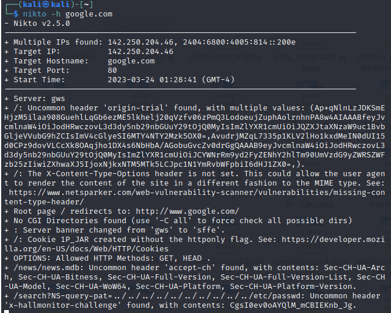
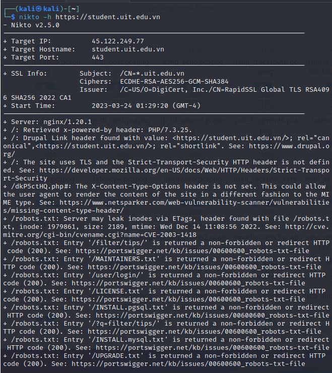

Chapter 13: Vulnerability Scanning and Intrusion Detection

## Table of content
- [Table of content](#table-of-content)
- [Snort and Security Onion](#snort-and-security-onion)
- [IPFire and its built-in Intrusion Prevention (IPS)](#ipfire-and-its-built-in-intrusion-prevention-ips)
- [Lynis](#lynis)
- [Nikto](#nikto)

## Snort and Security Onion

- Snort:
  - an NIDS (Network Intrusion Detection System)
    

  - Experiment Snort Inline with 3 Ubuntu Vmware
    - Set rule
      > alert icmp any any -> any any (msg:"detected ICMP"; sid:1000001;)
    - Start Snort:
        > sudo snort -c /etc/snort/test.conf -A cmg -i eths33

      

- Security Onion:
  - Includes a full implementation of Snort, complete with just about every graphical goody can help to visualize what's happening on network

## IPFire and its built-in Intrusion Prevention (IPS)

- IPFire:
  - a handy package have both edge firewall and an **Intrusion Detection System (IDS)**
  - a proxy of firewall, but there's more function as caching, content filtering, and NAT capabilities
  - Install it on a machine with at least two network interface adapters and configure it to match you network configuration:
    - With two network adapters, one connected to the internet and the other to the internal LAN
    - With three network adapters, we have one more to the **Demilitarized Zone (DMZ)**, where you have your internet-facing servers.
    - With fourth network adapter, plus protection for a wireless network.

## Lynis

- A portable shell script that you can use on different Unix systems and Unix-like systems.
- A multipurpose tool, can use for auditing, vulnerability scanning or hardening.
> sudo lynis audit system
    

## Nikto

- Only one purpose: scan web servers

==> How to protect a web server against these kinds of vulnerabilities
- Ensure not have any risky executable files on your web server
- Use some form of mandatory access control as SELinux or AppArmor
- Installing a web application firewall as ModSecurity
- Keep the systems updated 

