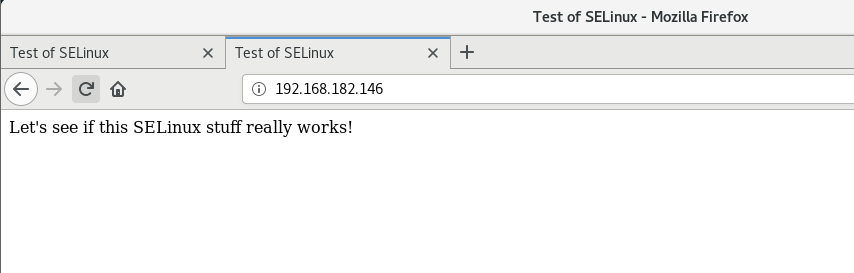
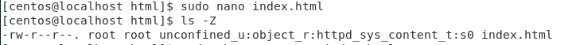
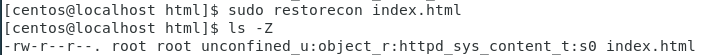
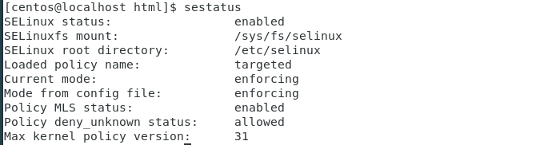
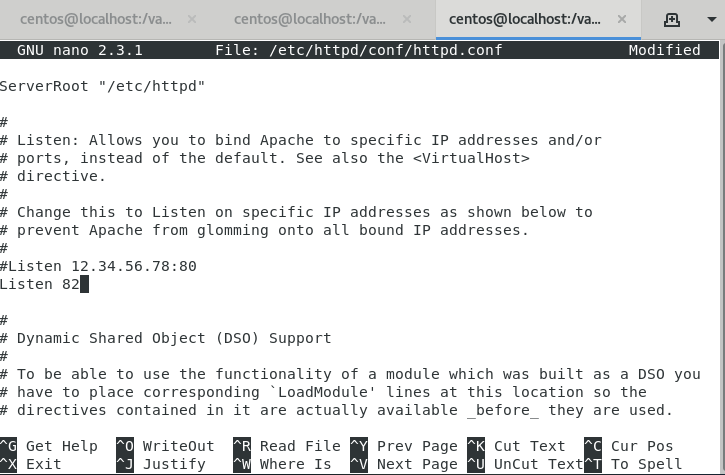
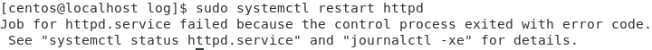
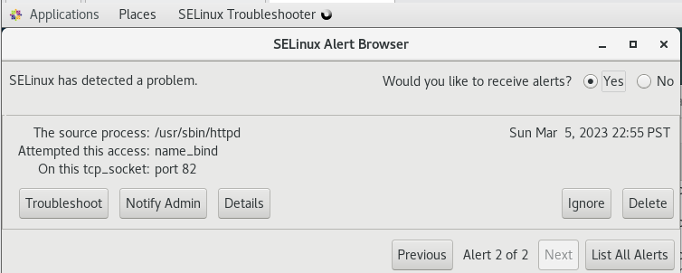
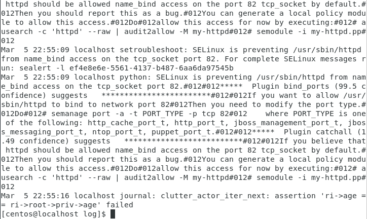
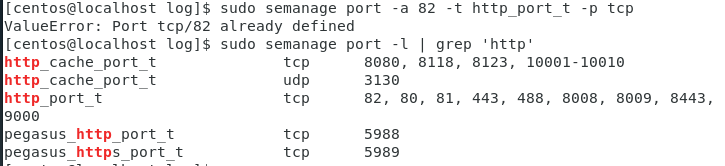
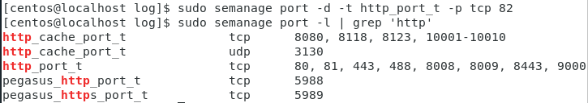

Chapter 9: Implementing Mandatory Access Control with SELinux and AppArmor

## Table of content
- [Table of content](#table-of-content)
- [SELinux](#selinux)
  - [How SELinux can benefit a systems administrator](#how-selinux-can-benefit-a-systems-administrator)
  - [Setting security contexts](#setting-security-contexts)
  - [Hands-on lab – SELinux type enforcement](#hands-on-lab--selinux-type-enforcement)
  - [Troubleshooting with setroubleshoot](#troubleshooting-with-setroubleshoot)
  - [SELinux policies](#selinux-policies)
  - [Hands-on lab – SELinux Booleans and ports](#hands-on-lab--selinux-booleans-and-ports)
- [AppArmor](#apparmor)
  - [AppArmor profiles](#apparmor-profiles)
  - [AppArmor command-line utilities](#apparmor-command-line-utilities)
  - [Troubleshooting AppArmor problems](#troubleshooting-apparmor-problems)
  - [Exploiting a system with an evil Docker container](#exploiting-a-system-with-an-evil-docker-container)

## SELinux
### How SELinux can benefit a systems administrator
- **SELinux** is a free open source software project, three ways to used:
  - Help prevent intruders from exploiting a system
  - Ensure that only users with the proper security clearance can access files that are labeled with a security classification.
  - in addition to MAC, SELinux can be used as a type of role-based access control

- **SELinux** is also can help protect data in users's home directories. 
- On web servers, **SELinux** can help to prevent the execution of malicious CGI scripts or PHP scripts
- With Docker and without MAC, it is a useful tools for hardening servers that run Docker containers.

### Setting security contexts
- SELinux as a glorified labeling system
  - It adds labels - security context to files and directories through extended file attributes. 
  - It adds the same type of labe - domains to system processes
- Use `ps -Z`, `ls -Z` to see these context and domains, output will contains user, role, type, sensitivity, category.
  
- Installing the SELinux tools
  - On CentOS 7:
    > sudo yum install setools policycoreutils policycoreutils-python

    > sudo yum install setroubleshoot
    > sudo service auditd restart
  - Run `sestatus` to check status of SELinux

- Fixing an incorrect SELinux context
  - `chcon`
    - Two ways to fix an incorrect SELinux type on a file or directory :
      - Manually specify the proper type
        - > sudo chcon -t \<SELinux type> \<filename>
      - Reference a file (A) that has the proper context 
        - > sudo chcon --reference \<filename to reference> \<filename>
  - `restorecon`
    - > sudo restorecon \<filename>
  - `semanage`:
    - Change by `chcon` or `restorecon` won't survive a system reboot, to make change permanent, we will need to use `semanage`

### Hands-on lab – SELinux type enforcement
- Install SELinux
- Configure the firewall to allow access to the web server
  > sudo firewall-cmd --permanent --add-service=http
  >  sudo firewall-cmd --reload
- Create a simple web 

- Check SELinux context

- A SELinux type have been changed to tmp

- Fix SELinux type by `restorecon`

### Troubleshooting with setroubleshoot

- File log for SELinux rule: */var/log/audit/audit.log* file
- Using the graphical setroubleshoot utility: will automatically alert you when setroubleshoot detects a problem.
- Troubleshooting in permissive mode
  - Use when you might have more than one problem.
  - In permissive mode, SELinux allows actions that violate policy to occur, but it will log them
  - Use `getenforce` or `sestatus` to check our current mode
  
 
### SELinux policies

- Booleans:
  - Each booleans presents a binary choice. It allows or prohibits something.
  - Command
    - `getsebool -a` to see all Booleans in the system
    - `getsebool <boolean_name> <on/off>` to set a booleans to on or off (use `-P` to make the change permanent)
  - Protecting your web server
    - `getsebool -a | grep 'http'`: Show booleans useful in protecting our web server
  - Protecting networks ports:
    - `sudo semanage port -l` : Show list of allowed ports

- Creating custom policy modules: If SELinux would

### Hands-on lab – SELinux Booleans and ports

- Change port httpd listen from 80 to 82
  
- Restart httpd service and get the error
  
- We can see SELinux Alert Browser
  
- View the error messages `sudo tail -20 /var/log/messages`
  
- Add port 82 to allowed list
  
- Delete port 82 : `sudo semanage port -d -t http_port_t -p tcp 82`
  

## AppArmor

- Do pretty much the same job as SELinux, its mode of
operation is substantially different:
  - Uses pathname enforcement (no need to insert label as SELinux)
  - 
### AppArmor profiles

### AppArmor command-line utilities

### Troubleshooting AppArmor problems

### Exploiting a system with an evil Docker container