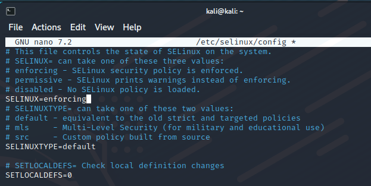

Chapter 9: Implementing Mandatory Access Control with SELinux and AppArmor

## Table of content
- [Table of content](#table-of-content)
- [SELinux](#selinux)
  - [How SELinux can benefit a systems administrator](#how-selinux-can-benefit-a-systems-administrator)
  - [Setting security contexts for files and directories](#setting-security-contexts-for-files-and-directories)
- [Hands-on lab – SELinux type enforcement](#hands-on-lab--selinux-type-enforcement)
- [Troubleshooting with setroubleshoot](#troubleshooting-with-setroubleshoot)
  - [Troubleshooting in permissive mode](#troubleshooting-in-permissive-mode)
- [Working with SELinux policies](#working-with-selinux-policies)
- [How AppArmor can benefit a systems administrator](#how-apparmor-can-benefit-a-systems-administrator)
- [Looking at AppArmor profiles](#looking-at-apparmor-profiles)
- [Working with AppArmor command-line utilities](#working-with-apparmor-command-line-utilities)
- [Troubleshooting AppArmor problems](#troubleshooting-apparmor-problems)
- [Exploiting a system with an evil Docker container](#exploiting-a-system-with-an-evil-docker-container)

## SELinux
### How SELinux can benefit a systems administrator
- **SELinux** is a free open source software project, three ways to used:
  - Help prevent intruders from exploiting a system
  - Ensure that only users with the proper security clearance can access files that are labeled with a security classification.
  - in addition to MAC, SELinux can be used as a type of role-based access control

- **SELinux** is also can help protect data in users's home directories. 
- On web servers, **SELinux** can help to prevent the execution of malicious CGI scripts or PHP scripts
- With Docker and without MAC, it is a useful tools for hardening servers that run Docker containers.

### Setting security contexts for files and directories
- SELinux as a glorified labeling system
  - It adds labels - security context to files and directories through extended file attributes. 
  - It adds the same type of labe - domains to system processes
- Use `ps -Z`, `ls -Z` to see these context and domains, output will contains user, role, type, sensitivity, category.
  
   Installing the SELinux tools

- On CentOS 7:
  > sudo yum install setools policycoreutils policycoreutils-python

  > sudo yum install setroubleshoot
  > sudo service auditd restart
- Run `sestatus` to check status of SELinux

- Fixing an incorrect SELinux context

- `chcon`
  - Two ways to fix an incorrect SELinux type on a file or directory :
    - Manually specify the proper type
    - Reference a file that has the proper context 
- `restorecon`
- `semanage`:
  - Change by `chcon` or `restorecon` won't survive

## Hands-on lab – SELinux type enforcement
- Create a simple web 

- Check SELinux context

## Troubleshooting with setroubleshoot

- File log for SELinux rule: */var/log/audit/audit.log* file

- Using the graphical setroubleshoot utility

- There is a graphical utility that will automatically alert you when setroubleshoot detects a problem.

### Troubleshooting in permissive mode

- Use when you might have more than one problem.
- In permissive mode, SELinux allows actions that violate policy to occur, but it will log them
- 

## Working with SELinux policies

## How AppArmor can benefit a systems administrator

## Looking at AppArmor profiles

## Working with AppArmor command-line utilities

## Troubleshooting AppArmor problems

## Exploiting a system with an evil Docker container