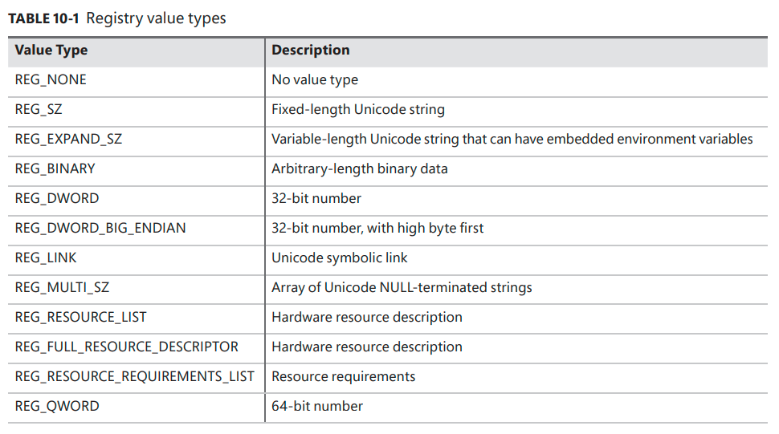
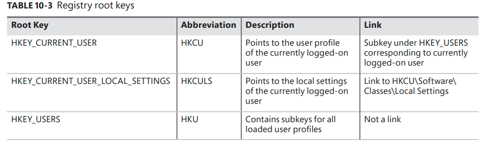
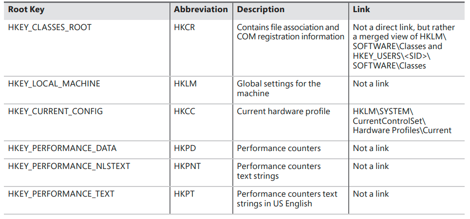
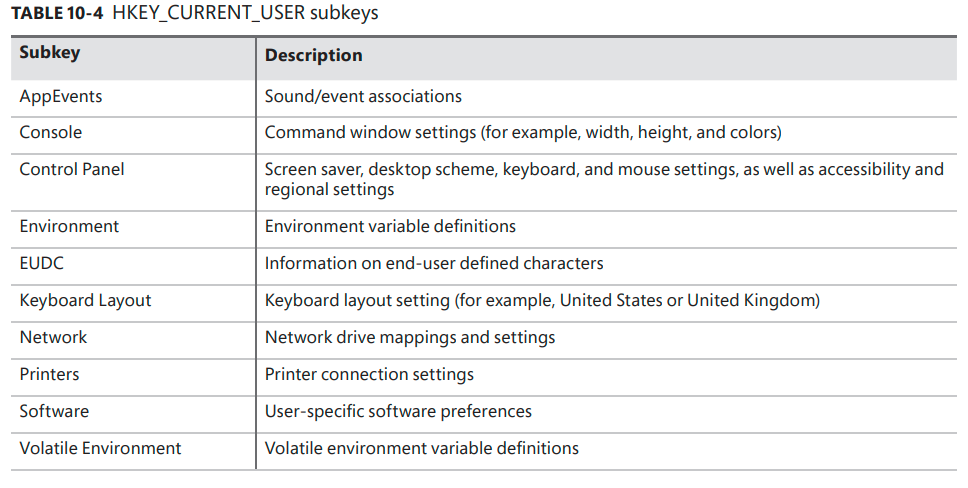

# Management diagnostics and tracing

## Table of contents

## The Registry

- It is the repository
for both systemwide and per-user settings --> plays a key role in the configuration and control of Windows systems

## Viewing and changing the registry

- `Regedit.exe` : main GUI tool for editing the registry.
- `Reg.exe` : can import, export, back up, and restore keys, as well as to compare, modify, and delete keys and values. It can also set or query flags used in UAC virtualization
- `Regini.exe` : allows you to import registry data based on text files that contain ASCII or Unicode configuration data.
- `Offreg.dll` (from WDK): Host the Offline Registry Library, this library allows loading registry key hive files in their binary format and applying operations on the files themselves, bypassing the usual logical loading and mapping that Windows requires for registry operations

## Registry usage
- When is it read?
    - During the initial boot process
    - During the kernel boot process
    - During logon, Explorer and other Windows components read per-user preferences
    - During applications startups.
- When is it modified?
    - During the installation of a device driver
    - Application setup utilities create default application settings
    - When you change application or system settings through user interface.
    - Many default settings are defined by a prototype version of the registry that ships on the Windows setup media.

## Registry data type

- Contain:
    - `keys` : consist of other keys (subkeys or values)
    - `values` : store data

## Registry logical structure

> Note: H in root key means Windows Handle Key

## HKEY_CURRENT_USER 
- Contains data regarding the preferences and software       configuration of the locally
logged-on user

## HKEY_USERS
- Contains subkeys for all loaded user profiles

## HKEY_CLASSES_ROOT
- Contains file association and COM registration information
- Consist of three types of information: 
  - File extension associations.
  - COM class registrations.
  - The Virtualized registry root for User Account Control (UAC) 
- Data under HKCR comes from two sources:
  - The per-user class registration data in HKCU\SOFTWARE\Classes (mapped to the file on hard
disk \Users\<username>\AppData\Local\Microsoft\Windows\Usrclass.dat)
  - Systemwide class registration data in HKLM\SOFTWARE\Classes

## HKEY_LOCAL_MACHINE
- Global settings for the machine
- Contains all the systemwide configuration subkeys:
  - `BCD00000000` :  Boot Configuration Database (BCD) information. BCDEdit command-line utility allows you to modify the BCD using symbolic names for the elements and objects
  - `COMPONENTS` :  information pertinent to the Component-Based
Servicing (CBS) stack (this stack contains various files and resources that are part of a Windows installation image)
  - `HARDWARE` : descriptions of the system’s legacy hardware and some  hardware device-to-driver mappings
  - `SAM`(Security Account Manager) : holds local account and group information, such as user passwords, group definitions, and domain associations.
  - `SECURITY` : stores systemwide security policies and user-rights assignments
  - `SOFTWARE` : stores systemwide configuration information not needed to boot the system, paths to application files and directories, and licensing and expiration date information of third-party applications.
  - `SYSTEM` : contains the systemwide configuration information needed to boot the system (which device drivers to load and which services to start)

#### HKEY_CURRENT_CONFIG
- Current hardware profile

#### HKEY_PERFORMANCE_DATA and HKEY_PERFORMANCE_TEXT<
- This registry is the mechanism used to access performance counter values on Windows. 
- Available only programmatically through Windows Registry functions (ex *RegQueryValueEx*)
- HKEY_PERFORMANCE_DATA  
- HKEY_PERMANCE_TEXT

### Application hives

### Transactional Registry (TxR)

### Monitoring registry activity

### Process monitor internals

### Registry Internal

### Hive reorganization

### The registry namespace and operation

### Stable storage

### Registry filtering

### Registry virtualization

### Registry optimizations

----------------------

## Windows services
## Task scheduling and UBPM
## Windows Management Instrumentation
## Event Tracing for Windows (ETW)
## Dynamic tracing (DTrace)
## Windows Error Reporting (WER)
## Global flags
## Kernel shims

