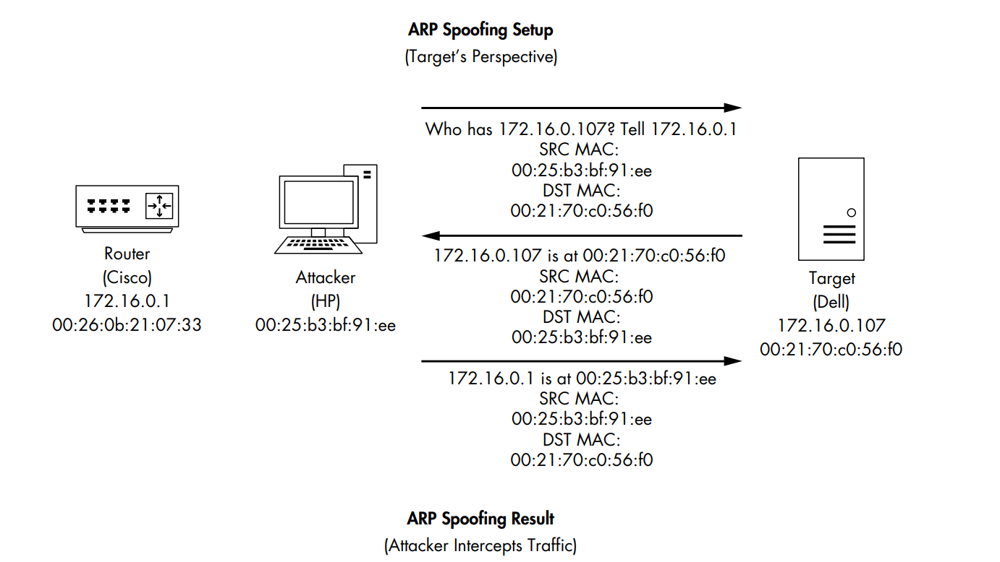
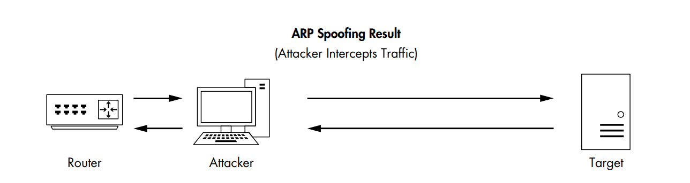
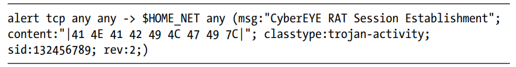

# Chapter 10: Packet Analysis for Security

## Table of content
- [Chapter 10: Packet Analysis for Security](#chapter-10-packet-analysis-for-security)
  - [Table of content](#table-of-content)
  - [Reconnaissance](#reconnaissance)
  - [Traffic Manipulation](#traffic-manipulation)
  - [Malware](#malware)

In this chapter:
    - As a security practitioner, we will examine different aspects of a system compromise at the network kernel:
      - Network reconnaissance
      - Malicious traffic redirection
      - System exploitation
    - With role of an intrusion analyst, we wil dissect traffic based on alerts from an Intrusion-detection system (IDS)
  
## Reconnaissance

- SYN Scan (stealth scan, half-open scan)
  - This is the most common type scanning when against a system
  - Using Filters
  - Identifying Open and Closed Ports

  

  Identify port are open
  

- Operating System Fingerprinting
  - Helps the attacker configure all
their methods of attack correctly
  - Know the location of certain critical files and directories within the target file system
  - Type
    - Passive 
    - Active

## Traffic Manipulation

- ARP Cache Poisoning
  - ARP protocol is used to allow devices to map IP addresses to MAC addresses inside of a network
  - A form of the man-in-the-middle (MITM) attack
  - Note: ARP packet has two types:
    - Request: sent as a broadcast to all hosts on the network in order to find the machine that has the MAC address associated
    - Response: the machine that replies to the requesting device sends a response.
with a particular IP address
  - 
  - 
  - To find it, we need to configure an IDS to address it or software running on devices designed to detect sudden changes in ARP
table entries
- Session Hijacking
  - An attacker compromises an HTTP session cookie, and uses it to impersonate another user
  - First attacker can use ARP cache poisoning to intercept a target’s traffic and find relevant session cookie information

## Malware

- [Operation Aurora](https://www.makeuseof.com/operation-aurora/)
  - Context: In January 10, Operation Aurora was exploited an unknown vulnerability in Internet Explorer: this vulnerability allowed attacker to gain remote control of targeted machines at Google, among other companies.
    - A website using a vulnerable version of Internet Explorer 
    - Attacker use *spear phishing*, sent an email to victim and to get recipients to click a link leading to a malicious site, was used to lure the targets.
    - The attacker's web server transmit a web page containing JS code includes a vulnerability exploit and iframe includes a link to a GIF
    - When the page is rendered in the target's browser, the code executes on their machine, exploit a vuln on IE and opening a session to attacker at port 4321

- Remote-Access Trojan:
  - A type of malware that allows an attacker to gain unauthorized access to a victim's computer or network
  - IDS alert:
      
      
  - Signature : 41 4E 41 42 49 4C 47 49 7C

