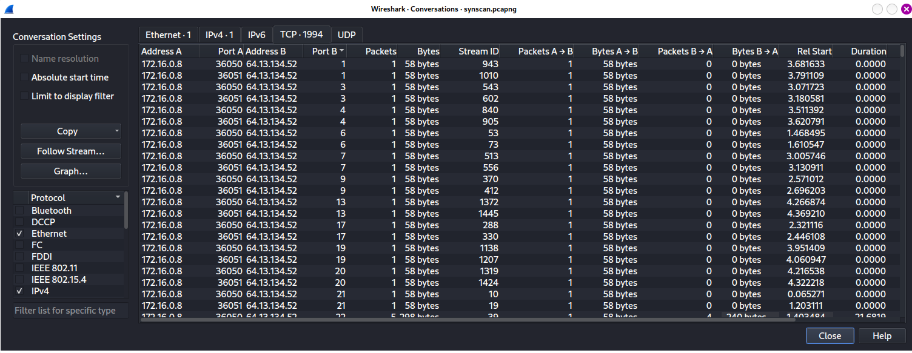
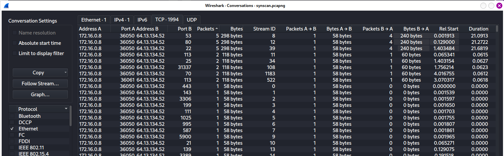

# Chapter 10: Packet Analysis for Security

## Table of content
- [Chapter 10: Packet Analysis for Security](#chapter-10-packet-analysis-for-security)
  - [Table of content](#table-of-content)
  - [Reconnaissance](#reconnaissance)
  - [Traffic Manipulation](#traffic-manipulation)
  - [Malware](#malware)

In this chapter:
    - As a security practitioner, we will examine different aspects of a system compromise at the network kernel:
      - Network reconnaissance
      - Malicious traffic redirection
      - System exploitation
    - With role of an intrusion analyst, we wil dissect traffic based on alerts from an Intrusion-detection system (IDS)
  
## Reconnaissance

- SYN Scan (stealth scan, half-open scan)
  - This is the most common type scanning when against a system
  - Using Filters
  - Identifying Open and Closed Ports

  

  Identify port are open
  

- Operating System Fingerprinting
  - Helps the attacker configure all
their methods of attack correctly
  - Know the location of certain critical files and directories within the target file system
  - Type
    - Passive 
    - Active

## Traffic Manipulation

- ARP Cache Poisoning
- Session Hijacking

## Malware

- Operation Aurora
- Remote-Access Trojan

