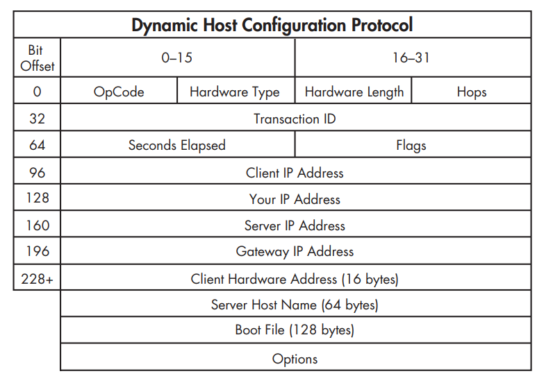
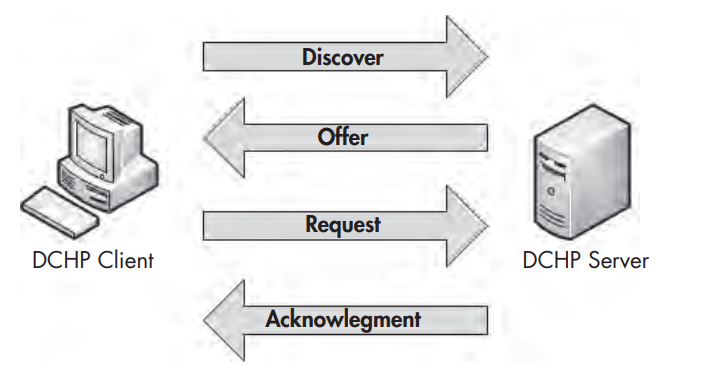

Chapter 7: Common Upper-Layer Protocols

## Table of contents

- [Table of contents](#table-of-contents)
- [Dynamic Host Configuration Protocol](#dynamic-host-configuration-protocol)
- [Domain Name System](#domain-name-system)
  - [The DNS Packet Structure](#the-dns-packet-structure)
  - [A Simple DNS Query](#a-simple-dns-query)
  - [DNS Question Types](#dns-question-types)
  - [DNS Recursion](#dns-recursion)
  - [DNS Zone Transfers](#dns-zone-transfers)
- [Hypertext Transfer Protocol](#hypertext-transfer-protocol)
  - [Browsing with HTTP](#browsing-with-http)

## Dynamic Host Configuration Protocol
  
- An application layer protocol allowing a devices to automatically obtain an IP address
- DHCP servers provide other parameters to clients: address of the default gateway and DNS servers,..

- The DHCP Packet Struture:
    

- The DHCP Renewal Process
  - The `renewal process` (DORA process) takes place between a single client and a DHCP server, use four types of DHCP packet:
    - Discover: Find a DHCP server that will listen
      - DCHP message type
      - Client Identifier
      - Requested IP Address
      - Parameter Request List
    - Offer
    - Request
    - Acknowledgment
    

## Domain Name System

The Domain Name System (DNS) is one of the most crucial Internet protocols because it is the proverbial molasses that holds the bread together

### The DNS Packet Structure

### A Simple DNS Query

A client wishing to resolve a DNS name to an IP address sends a query to a DNS server, and the server sends the requested information in its response

### DNS Question Types

The Type fields used in DNS queries and responses indicate the resource record type that the query or response is for, more details [here](http://www.iana.org/assignments/dns-parameters/)

### DNS Recursion

The DNS server acts like a client, and this process is called recursion

### DNS Zone Transfers

- Zone transfer occurs when zone data is transferred between two devices, typically out of desire for redundancy
- Two types of zone transfers:
  - Full zone transfer (AXFR)
  - Incremental zone transfer (IXFR)
- The data contained in a zone transfer can be very dangerous in the wrong hands

## Hypertext Transfer Protocol

HTTP is the delivery mechanism of the World Wide Web, allowing web browsers to connect to web servers to view web pages

### Browsing with HTTP

