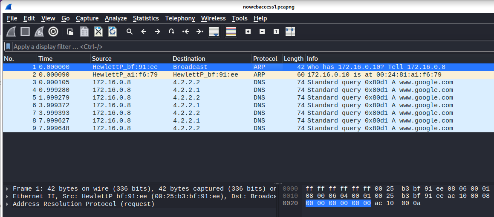
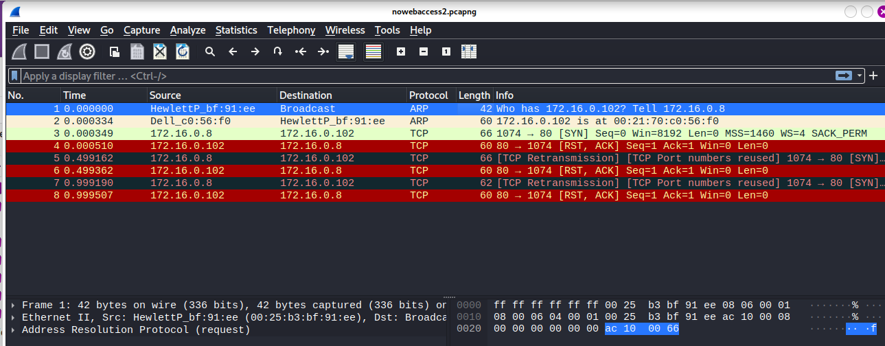

# Chapter 8: Basic Real-World Scenarios

## Table of content
- [Chapter 8: Basic Real-World Scenarios](#chapter-8-basic-real-world-scenarios)
  - [Table of content](#table-of-content)
  - [Missing Web content](#missing-web-content)
  - [No Internet Access](#no-internet-access)
    - [Gateway Configuration Problems](#gateway-configuration-problems)
    - [Unwanted Redirection](#unwanted-redirection)
    - [Software Data Corruption](#software-data-corruption)

At this chapter, we start to analyze real-world network
problems. The book will introduce a series of problem scenarios. After analysis, this book will point toward potential solutions and give an overview of the lessons learned.

## Missing Web content

**Context**: Packet Pete browse to ESPN, the page take a long time to load, and when it finally does, most of the images and content are missing.

**Analysis**:
- Looking at the HTTP protocol: `Statistics > HTTP > Requests`:
  - Seven different HTTP request with six have string *espn* and one is *content delivery content* (CDN - used to deliver advertising to a multitude of sites)
     
- Look at the protocol hierarchy: `Statistics > Protocol Hierarchy`:
    > Unexpected protocols
    > Peculiar distributions of traffic per protocol
  - Only two application-layer protocols at work: HTTP and DNS
    - 14 DNS packet (7 queries + 7 replies) => 7 IP conversations
    
- Look at the conversations: `Statistics > Conversations`
  - 8 IP conversations (but we had find that is seven) => an additional conversation unrelated 
    - At conversation 172.16.16.154 <-> 203.0.113.94, we can see that 6615 bytes were sent to this unknown host but 0 bytes were sent back
    
    We don't see any SYN/ACK response => Peter's machine is try to connect to IP 203.0.113.94 which not exist or just not listening => make the web page load slowly.
    
    
- Pete's machine often browser to ESPN.com so it had a cached DNS-to-IP mapping for a domain that host content for ESPN => Pete's machine connected to an old address 
=> Solution: Clearing his DNS cache manually or try again in a few minutes, a new request will be generated.

**Lesson**: 
- In this case, we able to work toward a solution by
assessing multiple data points related to the requests and conversations => finding the failed communication between the client and one of ESPN’s content delivery servers

## No Internet Access

- Some common problems you might encounter when diagnose and solve internet connectivity
  
### Gateway Configuration Problems

**Context**: 

- A user cannot access the internet.
- The user can access all the internal resources of the network, including shares on other workstation and applications hosted on local servers.
- internet access is handled through a single router serving as the default gateway 

**Analysis**:

- We see a successful ARP request to the default gateway router for the network 
=> The device actually transmitting packets on the network => Protocol stack, network router don't have any issue
- DNS queries are resolved by an external server on the internet (4.2.2.2 or 4.2.2.1)
=> Correct resolution
=> The router responsible for routing packets to the internet must successfully forward the DNS queries to the server, and the server must respond => remote DNS server isn't the problem

=> User's computer have problem, the default gateway address maybe set incorrectly. The address set as the default gateway is not a router and cannot forward the DNS query packets outside the network.

**Lesson**:
- Wireshark didn’t identify the problem exactly, but it did tell us where to look, saving valuable time.
- If we know this particular network’s IP-addressing scheme, the problem could have been identified immediately once we noticed that the ARP request was sent to an IP address different from that of the gateway router

### Unwanted Redirection

**Context**: 
- A user can access the internet, but they can't access their home page (google.com), but they are directed to a browser page
that says, “Internet Explorer cannot display the web page.

**Analysis**:

-  Following the ARP request and reply, we would expect to see a DNS query sent to our configured DNS server in order to find the IP address associated with https://
www.google.com/, but we don’t.
- Two conditions could prevent the device make a DNS query:
  - It already has the DNS name-toIP address mapping in its DNS cache
  - It already has the DNS name-toIP address mapping specified in its hosts file

> This very common scenario is one that malware has been using for years to redirect users to websites hosting malicious code

**Lesson**:
- We will need to learn both how the various protocols work and how to break them if we continue to analyze traffic

### Software Data Corruption