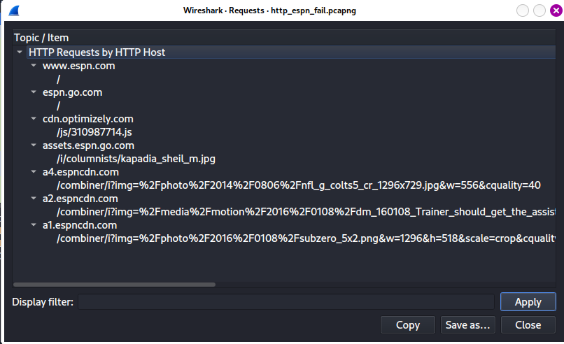
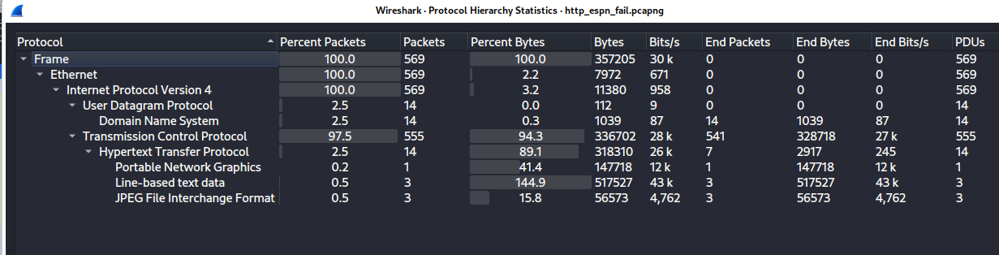
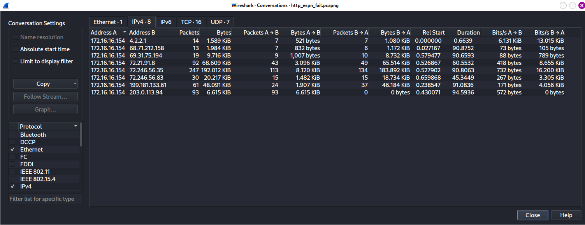
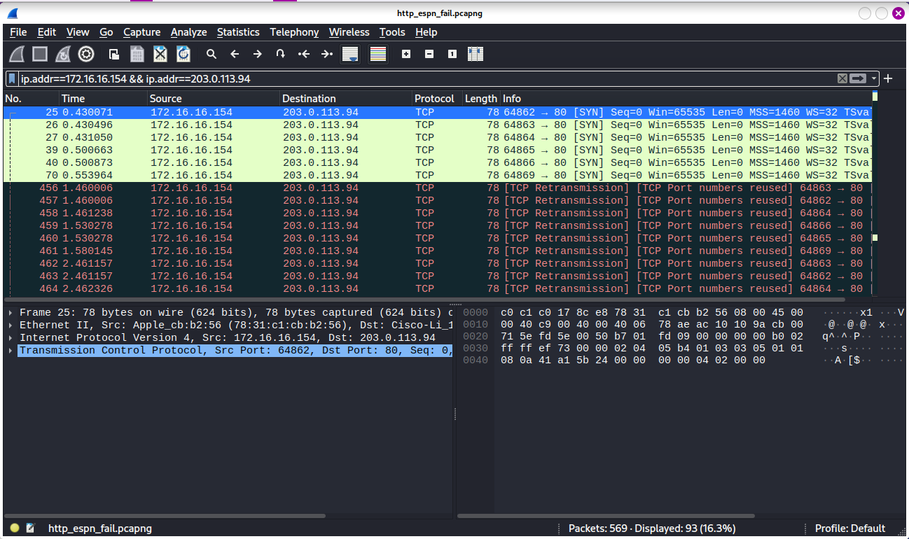

# Chapter 8: Basic Real-World Scenarios

## Table of content
- [Chapter 8: Basic Real-World Scenarios](#chapter-8-basic-real-world-scenarios)
  - [Table of content](#table-of-content)
  - [Missing Web content](#missing-web-content)

At this chapter, we start to analyze real-world network
problems. The book will introduce a series of problem scenarios. After analysis, this book will point toward potential solutions and give an overview of the lessons learned.

## Missing Web content

**Context**: Packet Pete browse to ESPN, the page take a long time to load, and when it finally does, most of the images and content are missing.

**Analysis**:
- Looking at the HTTP protocol: `Statistics > HTTP > Requests`:
  - Seven different HTTP request with six have string *espn* and one is *content delivery content* (CDN - used to deliver advertising to a multitude of sites)
     
- Look at the protocol hierarchy: `Statistics > Protocol Hierarchy`:
    > Unexpected protocols
    > Peculiar distributions of traffic per protocol
  - Only two application-layer protocols at work: HTTP and DNS
    - 14 DNS packet (7 queries + 7 replies) => 7 IP conversations
    
- Look at the conversations: `Statistics > Conversations`
  - 8 IP conversations (but we had find that is seven) => an additional conversation unrelated 
    - At conversation 172.16.16.154 <-> 203.0.113.94, we can see that 6615 bytes were sent to this unknown host but 0 bytes were sent back
    
    We don't see any SYN/ACK response => Peter's machine is try to connect to IP 203.0.113.94 which not exist or just not listening => make the web page load slowly.
    
    
- Pete's machine often browser to ESPN.com so it had a cached DNS-to-IP mapping for a domain that host content for ESPN => Pete's machine connected to an old address 
=> Solution: Clearing his DNS cache manually or try again in a few minutes, a new request will be generated.

*Lesson*: 

