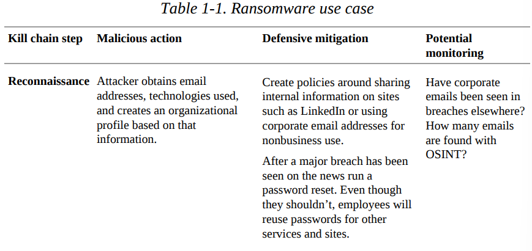
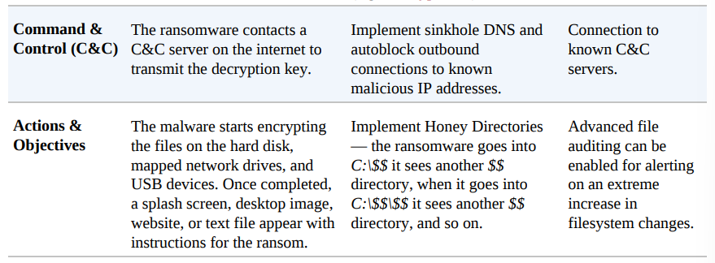

# Chapter 1: Creating Creating a Security Program

This chapter cover the skeleton of a security program and initial administrative steps

- The NIST (National Institute of Standards &
Technology) has a Framework Core consist five concurrent and continuous functions:
    - Identify
    - Protect
    - Detect
    - Respond
    - Recover
  => This framework provide a high-level, strategic view of  the lifecycle of an organization’s management of cybersecurity risk

- A good security team consist:
  - *Executive team*:
    - A chief information office (CIO)/ chief information security office (CISO):
      - The leverage and authority needed for business wide decisions and change
    - Also prove a long-term vision, communicate corporate risks, establish objectives, provide funding, and suggest milestones.
  - *Risk team*:
    - Calculate risks surrounding may other areas of the business, from sales to marketing and financials
    - Framework: Operationally Critical Threat, Asset, and Vulnerability Evaluation (OCTAVE) 
  - *Security team*:
    - Assess and strengthen the environment
    - Responsible for daily security operations:
      - Managing assets
      - Assessing threats and vulnerabilities
      - Monitoring the enviroment for attacks and threats
      - Managing risks
      - Providing training
    - Sub teams: networking, operation, application and offensive security
  - *Auditing team*:
    - A system of checks and balances
    - Ensure the correct tasks and milestones are being covered

- Baseline Security Posture: a baseline and discovery phase should be one of the first and foremost tasks. Baseline of the security should consist:
  - Policies and procedures
  - Endpoints - Desktops and servers
    - Implementation date 
    - Software version
  - Licensing and software renewal:
    - SSL certificates
  - Internet footprint - domains, mail servers, dmz devices
  - Networking devices - routers, switches, APs, IDS/IPS, and Network Traffic
  - Logging and monitoring
  - Ingress/egress points — ISP contacts, account numbers, and IP addresses
  - External vendors, with or without remote access, and primary contacts

- Assess Threats and Risks
  - Risk management:
    - *Identify*
      - Information Sharing and Analysis Centers (ISACs)
        - Collect, analyze and disseminate actionable threat information to their
        members and provide members with tools to mitigate risks and enhance resiliency
      - The OWASP top 10
      - The CIS 20 (Critical Security Controls)
    - *Assess*
      - Determine if they apply to the particular environment
      - Task:
        - Internal and external vulnerability scans
        - Firewall rule audits
        - Asset management
        - Discovery 
        => a larger picture to the type of overall risk exposure
    - *Mitigate*:
      - Risk avoidance
      - Risk remediation
      - Transferring of risk
      - Accepting risk
    - *Monitor*:
      - Keep track of the risk over time with scheduled quarterly or yearly meetings
      - Determine if the change is affecting risk in anyway.

- Prioritize:
  - Threats and risks must be prioritized from highest to lowest risk percentage for remediation.
  - Prioritization can differ greatly from environment to environment.

- Create Milestones:
  - Four tiers:
    - Tier 1: Quick wins
      - Can be accomplished in hours or days
      - High vulnerabilities as:
        - Eliminated one-off unused endpoints
        - Move legacy devices to a more secure network
    - Tier 2: This year:
      - Routing changes
      - User education implementation
      - Decommissioning shared accounts, services,
and devices
    - Tier 3: Next year:
      - Vulnerabilities and changes that require:
        -  A significant amount of planning 
        -  Rely on other fixes to be applied first fall into this tier
     - Examples: Domain upgrades, server and major infrastructure device replacements, monitoring, and authentication changes
    - Tier 4: Long-term:
      - Due to the length of a project, lack of budget, contract renewals, or difficulty of change. 
      - Example: network restructure, primary software replacement, or new data center builds.

- Use Cases:
  - Showcasing situations that may put critical
infrastructure, sensitive data, or other assets at risk
  - Lockheed Martin's Intrusion Kill Chain:
    - A model for actionable intelligence when defenders align enterprise defensive capabilities to the specific processes an adversary undertakes to target that enterprise
    - Seven steps:
      1. Reconnaissance
      2. Weaponization
      3. Delivery
      4. Exploitation
      5. Installation
      6. Command and Control (C2)
      7. Actions on Objectives
    
    
    
    
    
    

- A *drill* is when staff carries out as many of
the processes, procedures, and mitigation that would be performed during one of the emergencies as possible.

- A *tabletop exercise* is a meeting of key stakeholders and staff who walk step by step through the mitigation iof some type of disaster,  malfunction, attack, or other
emergency in a low stress situation.
  - A moderator/ facilitator: deliver the scenario to be played out
  - A member evaluate the overall performance of the exercise and create an after-action report.
  - Participants: finance, HR, legal, security, management, marketing,..
  - Tabletop include:
    - A handout to participants with the scenario and room for notes.
    - Current runbook of how security situations are handled
    - Any policy and procedure manuals.
    - List of tools and external services.
  - Post-exercise actions and questions
 
- Expanding your team and skill sets: 
  - Finding a dedicated, passionate, and intelligent team can be one of the most difficult aspects of any professional’s life
