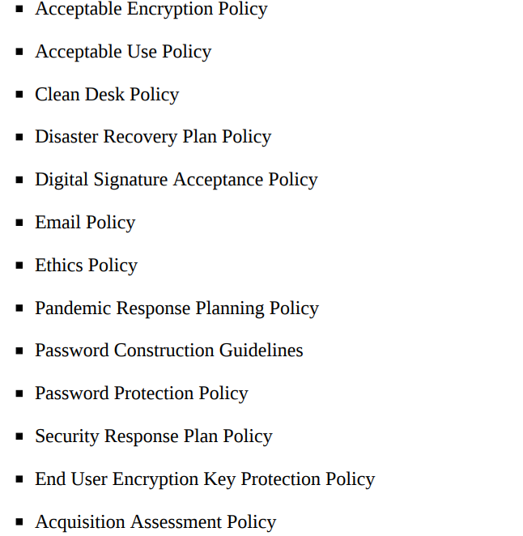
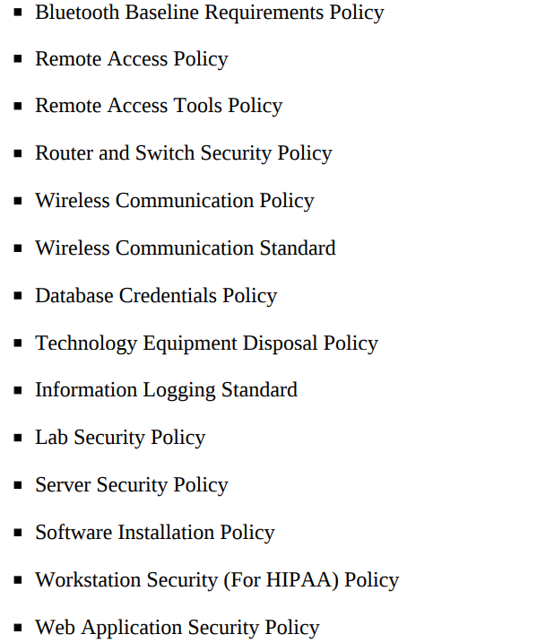

# Chapter 3. Policies 

Why policies are so important?
- Consistency
- Distribution of knowledge
- Setting Expectations
- Regulatory compliance and audit
- Sets the tone
- Management endorsement

## Language

- Policy statements should be fairy simple, clear, and use words like “do,” “will,” “must,” and “shall.”
- Document should be designed to be read. 

## Document Contents

- A few key features:
  - Revision control
  - Revision detail
  - Owner/approver
  - Roles and responsibilities
  - Executive signoff
  - Purpose/overview
  - Scope
  - Policy statements
  - Consistent naming convention
  - Related documents

## Topics

- For ease of reading, updating, and overall management it is probably easier to produce a set of policy documents rather than a single monolithic document.
- A list of template policies (SANS)
  
  

## Storage and Communication

- Policies must be easily accessible.
- Many software packages can not only provide a web interface for policies, but also have built-in review, revision control, and approval processes => makes it much
easier when there are a multitude of people and departments creating, editing, and approving policies.
- At least once per reviewal process, have two
copies of all policies printed out with a backup in physical form.