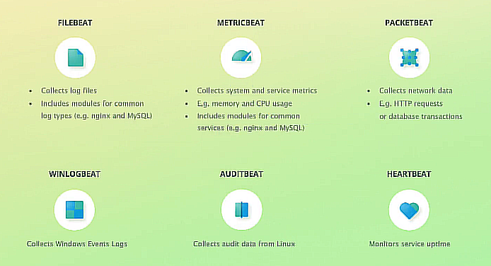

# Elastic Stack

## Elasticsearch

- Heart of ELK stack
- Powerful search engine
  - Fullstack searches
  - Query structure data such as numbers and aggregate data
  - Use the results to making pie charts
- Analyze applications logs and system metrics
- Applications Performance Management (APM)
- Anomality Detection

### How does Elasticsearch work?

- Data is stored as documents
- A documents's data is separated into fields
-  Querying:
   -  Use REST API
- Written in Java, built on Apache Lucene
## Kibana

- An analytics and visualization platform
  - Easily visualize data from elastic search and analyze it
- As an Elasticsearch dashboard  
- Can manage parts of Elasticsearch and Logstash

## Logstash

- A data processing pipeline
- The data that Logstash receives will be handled as event, log files entries, ecommerce orders, customers, chat messages => ship to Elasticsearch
- Three parts:
  - Inputs
  - Filters
  - Outputs

## Beats:

- A collection of so-called data shippers
- Lightweight agents that you install on servers, which then send data to Logstash or Elasticsearch

## Reference:

https://gitlab.com/kalilinux/kali-purple/documentation/-/blob/main/301_kali-purple/installation.txt