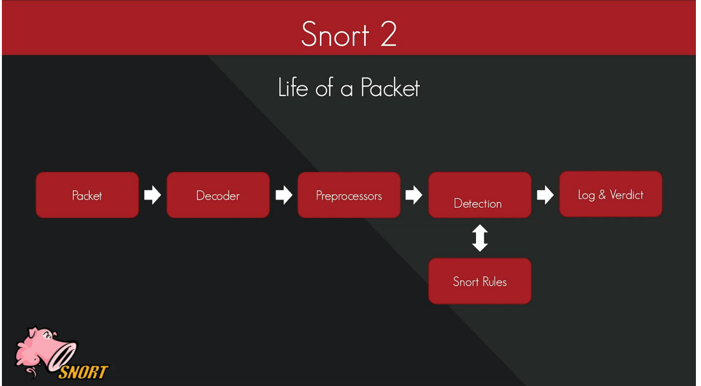
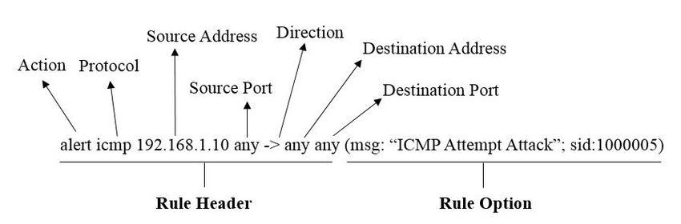
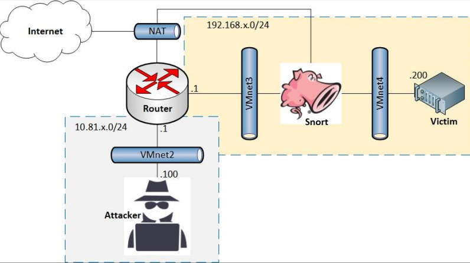
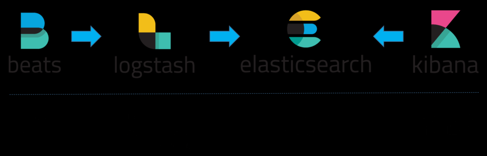
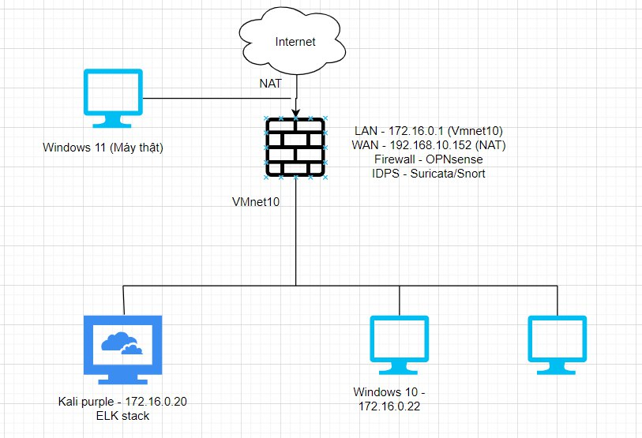
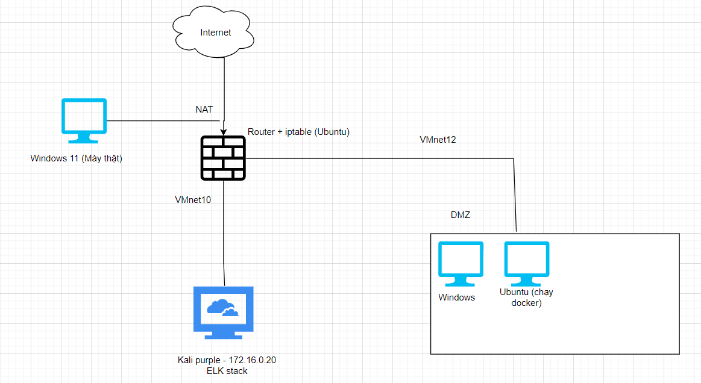

# Workshop-Blue-02-03

## Table of content
- [Workshop-Blue-02-03](#workshop-blue-02-03)
  - [Table of content](#table-of-content)
  - [Deployment snort](#deployment-snort)
    - [Detect and prevent DoS](#detect-and-prevent-dos)
    - [Detect and prevent SQLi](#detect-and-prevent-sqli)
  - [ELK stack](#elk-stack)
  - [Lab](#lab)
  

## Deployment snort

- Snort: 
  - Signature NIDPS
  - Analyzing network traffic in real-time and detecting potential threats or attacks, write log

Perform a network attack (Ping of Death, Network Scanning, DoS...) and write a Snort rule for detection.
Snort rule detects abnormal Payload
Perform protected content (Hash) related attack/intrusion and write Snort rules.

### Detect and prevent DoS

- Tool to attack: Slowloris
  - > python3 slowloris.py [website url] -s [number of sockets]
  
Victim: 192.168.4.200 (DVWA)

- Run snort
  - > sudo snort -A console -c /etc/snort/nhom4-snort.conf -Q -i ens37:ens38

- Rule to detect and prevent Dos
  - > alert tcp $EXTERNAL_NET any -> $HTTP_SERVERS 80 (msg:"Potential DoS Attack"; flow:to_server,established; content:"GET"; http_method; depth:4; flowbits:set,dos; threshold:type both, track by_src, count 10, seconds 10; classtype:attempted-dos; sid:1000003; rev:1;)

  - > drop tcp $EXTERNAL_NET any -> $HTTP_SERVERS 80 (msg:"Possible Slowloris DoS Attack"; flow:stateless; content:"GET"; depth:4; flowbits:set,sloris; threshold:type threshold, track by_src, count 50, seconds 10; sid:1000001; rev:1;)

### Detect and prevent SQLi

- Use DVWA - SQLi low to demo
  - ' OR 1=1 #
  - 1' OR 1=1 UNION SELECT 1, VERSION()#
  - 1' OR 1=1 UNION SELECT 1,DATABASE() #
  - 1' OR 1=1 UNION SELECT 1,table_name FROM  information_schema.tables WHERE table_type='base table' AND table_schema='dvwa' #
  - 1' OR 1=1 UNION SELECT user, password FROM users #

alert tcp any any -> 192.168.4.200 80 (msg:"SQLi Prevention - UNION Keyword"; flow:established,to_server; content:"UNION"; nocase; content:"SELECT"; nocase; sid:10000005; rev:1;)

## ELK stack

## Lab

- Object: Build an environment have:
  - Some vulnerable web (docker?)
  - ELK stack to analysis traffic, log (set Fleet server and agent, or just use Logstash)
  - Firewall (iptables, OPNsense, WAF, DBF?)
  - IDPS (Snort, Suricata?)

Attempt 1:

Problem:
- Kali can ping to outside, but Windows 11 can't ping to Kali (need port forward at OPNsense?)
- OPNSense: Internet down after 1-2 minutes, system routing have problem
- After set up Fleet server and agent on Windows 10, install a reverseshell.txt but Windows 10 machine just notify on Windows Defend (if it success, Windows 10 will get a notify from Elastic defend and send log to Fleet server)
- Fail to set up Logstash on Kali purple and Windows 10

Attempt 2:

Problem:
- Try to use a Ubuntu server as a router and set up iptables (instead of use OPNsense) but fail when configure DMZ zone

Attempt 3:

Plan A:
- Set up again but use VirtualBox instead of VMware
  - Real machine success to connect web from Kali machine in OPNsense

Problem: 
  - Can ping to 8.8.8.8 but can't ping to google.com

Plan B:
- Don't use OPNsense, focus on perform ELK stack
  - Set up ELK stack on Kali

